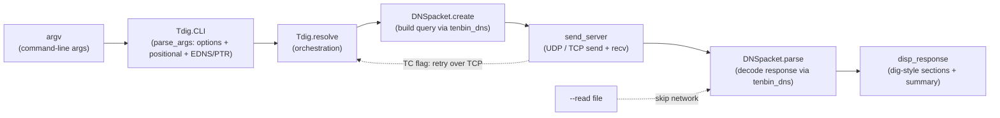

# tdig

A DNS lookup utility for the command line — an Elixir reimplementation of the classic Unix `dig` with a familiar output format and two distribution modes (escript for Elixir developers, Bakeware standalone binary for everyone else).

`tdig` is part of the [smkwlab DNS/Elixir ecosystem](https://github.com/smkwlab) and is built on top of the [`tenbin_dns`](https://github.com/smkwlab/tenbin_dns) packet library.

## Quick start

```bash
$ tdig example.com A @8.8.8.8

;; ->>HEADER<<- opcode: QUERY, status: No Error, id: 49671
;; flags:qr rd ra; QUERY: 1, ANSWER 2, AUTHORITY: 0, ADDITIONAL: 0

;; QUESTION SECTION:
;example.com.                   IN      A

;; ANSWER SECTION:
example.com.            37      IN      A       104.20.23.154
example.com.            37      IN      A       172.66.147.243

;; Query time: 28 ms
;; SERVER: 8.8.8.8#53(8.8.8.8)
;; WHEN: 2026-05-29 10:33:23
;; MSG SIZE rcvd: 61
```

## Features

- **dig-compatible output** — drop-in for scripts and humans used to `dig`
- **UDP and TCP transports** — `--tcp` for forced TCP, with optional truncation handling
- **IPv4 and IPv6** — auto-detected from the server address, or forced with `--v4` / `--v6`
- **EDNS0 support** — bufsize control and EDNS Client Subnet (ECS)
- **Reverse lookups** — `-x 1.2.3.4` expands to the proper `in-addr.arpa.` query
- **Read/write packet files** — round-trip raw DNS packets for offline analysis
- **Two build modes** — escript (small, needs Elixir runtime) or Bakeware (self-contained binary)

## Installation

### For end users — standalone binary (Bakeware)

Pre-built binaries published as GitHub release assets are self-contained and don't require Elixir or Erlang to be installed. Currently supported targets:

| Platform | Asset |
|---|---|
| Linux x86_64 | `tdig-linux-x86_64` |
| macOS arm64 (Apple Silicon) | `tdig-macos-arm64` |

Pick the binary matching your platform:

```bash
# Linux x86_64
curl -L -o tdig https://github.com/smkwlab/tdig/releases/latest/download/tdig-linux-x86_64
chmod +x tdig
./tdig example.com A

# macOS arm64
curl -L -o tdig https://github.com/smkwlab/tdig/releases/latest/download/tdig-macos-arm64
chmod +x tdig
./tdig example.com A
```

Or auto-detect via `uname`:

```bash
OS=$(uname -s | tr '[:upper:]' '[:lower:]' | sed 's/darwin/macos/')
ARCH=$(uname -m)
curl -L -o tdig "https://github.com/smkwlab/tdig/releases/latest/download/tdig-${OS}-${ARCH}"
chmod +x tdig
./tdig example.com A
```

### For Elixir developers — escript

If you already have Elixir installed and want a fast iterative build:

```bash
git clone https://github.com/smkwlab/tdig.git
cd tdig
mix deps.get
mix escript.build
./tdig example.com A
```

The `tdig` escript file produced is small and requires `erl` / `escript` on `PATH` at runtime.

### Building a release locally (Bakeware)

To produce your own standalone binary:

```bash
MIX_ENV=prod mix release
./_build/prod/rel/bakeware/tdig example.com A
```

## Usage

The command line syntax mirrors `dig`:

```
tdig [options] [@server] host [type] [class]
```

Positional arguments may appear in any order with respect to options; the leading `@` denotes the DNS server.

When unspecified:
- **server** defaults to `8.8.8.8`
- **type** defaults to `A`
- **class** defaults to `IN`
- **port** defaults to `53`

### Common record types

```bash
tdig example.com A          # IPv4 address
tdig example.com AAAA       # IPv6 address
tdig gmail.com MX           # mail exchangers
tdig example.com NS         # name servers
tdig example.com SOA        # start of authority
tdig example.com TXT        # text records
tdig example.com CNAME      # canonical name
```

### Reverse lookup (PTR)

```bash
tdig -x 1.1.1.1
# equivalent to:
tdig 1.1.1.1.in-addr.arpa. PTR
```

### Force TCP transport

```bash
tdig --tcp example.com A
```

UDP responses with the `TC` (truncated) flag are normally retried over TCP. Pass `--ignore` to suppress that retry.

### Querying a specific server

```bash
tdig example.com A @1.1.1.1                       # Cloudflare DNS
tdig example.com AAAA @2606:4700:4700::1111       # IPv6 server (auto-detected)
tdig example.com A @127.0.0.1 -p 5353             # non-standard port
```

### EDNS0

```bash
tdig -e example.com A                             # advertise EDNS0
tdig -b 4096 example.com A                        # advertise a specific buffer size (implies -e)
tdig --subnet 192.0.2.0/24 example.com A          # EDNS Client Subnet (IPv4)
tdig --subnet 2001:db8::/48 example.com AAAA      # ECS over IPv6
```

### Reading and writing DNS packets

`tdig` can save the raw wire packets and replay them — useful for offline parsing, fuzzing, or capture comparison.

```bash
tdig --write response.bin example.com A         # save the answer packet
tdig --write-request query.bin example.com A    # save the outgoing query
tdig -r response.bin                            # parse and print a saved packet
```

## Options reference

```
Usage: tdig [options] [@server] host [type] [class]

options
-c --class <class>        specify query class
-t --type <type>          specify query type
-p --port <port>          specify port number
-x --ptr                  shortcut for reverse lookup
   --v4                   use IPv4 transport
   --v6                   use IPv6 transport
   --tcp                  TCP mode
   --ignore               Don't revert to TCP for TC responses
-e --edns                 use EDNS0
-b --bufsize <size>       set EDNS0 Max UDP packet size
   --subnet <addr/len>    send EDNS Client Subnet option
-s --sort                 sort RRs
-r --read <file>          read packet from file
-f        <file>          same as -r
-w --write <file>         write answer packet to file
   --write-request <file> write request packet to file
-v --version              print version and exit
-h --help                 print help and exit
```

Run `tdig --help` for the in-binary reference.

## How does it compare to `dig`?

| | `dig` (BIND) | `tdig` |
|---|---|---|
| Output format | dig-style sections | **dig-style sections (compatible)** |
| Default server | `/etc/resolv.conf` | `8.8.8.8` |
| Distribution | OS package | **Standalone Bakeware binary or escript** |
| Runtime | C, no runtime needed | Erlang/Elixir runtime (escript) or self-contained (Bakeware) |
| EDNS Client Subnet | `+subnet=` | `--subnet` |
| TCP forcing | `+tcp` | `--tcp` |
| Reverse lookup | `-x` | `-x` |
| Packet I/O | external tools | **Built-in `--read` / `--write`** |

If you already have BIND's `dig`, you don't need `tdig`. It's useful when:

- you want a single self-contained binary you can copy to a minimal container or jump host
- you want to embed DNS lookups in Elixir tooling and share parsing/serialization with [`tenbin_dns`](https://github.com/smkwlab/tenbin_dns)
- you want raw packet read/write without piping through `tcpdump` or `dnsperf`

## Requirements

- **Bakeware binary**: no runtime requirement
- **escript / source build**: Elixir 1.17 or later, Erlang/OTP 27 or later. CI exercises the matrix Elixir 1.17.3 / OTP 27.3.4.4 (LTS) and Elixir 1.19.5 / OTP 28.5 (latest) via the shared reusable workflow `smkwlab/.github/.github/workflows/elixir-ci.yml@v1`.
- **Git** is needed for `mix deps.get` because `tenbin_dns` is fetched from a git tag

## Architecture

`tdig` is a thin query pipeline: command-line arguments are parsed into a single options map, that map drives DNS resolution, and the wire response is parsed and printed in `dig`-style sections. The same entry point (`Tdig.CLI.main/1`) backs both the escript and Bakeware builds.



Legend and notes:

- **Solid arrows** trace the main request/response data flow; **dotted arrows** are conditional side paths.
- `Tdig.CLI.parse_args/1` turns `argv` into an options map: it parses switches and positional `[@server] host [type] [class]` arguments, applies defaults (server `8.8.8.8`, type `A`, class `IN`, port `53`), auto-selects IPv4/IPv6 from the server address, and handles EDNS0 and `-x` reverse-lookup rewriting. `process/1` short-circuits `--version` / `--help` before reaching resolution.
- `Tdig.resolve/1` builds the query with `tenbin_dns` (`DNSpacket.create/1`), sends it over UDP or TCP via the `socket` library, then parses and renders the reply (`DNSpacket.parse/1` → `disp_response/3`).
- **TC retry** (dotted): a truncated UDP response re-enters `resolve/1` in TCP mode unless `--ignore` is set.
- **`--read`** (dotted): a saved packet file is fed straight into the parse/display stage, bypassing the network entirely. `--write` / `--write-request` (not shown) persist the raw answer / query packets along the main path.
- The two build modes (escript vs. Bakeware) share this exact pipeline; they differ only in packaging, not in query handling.

## Development

```bash
mix deps.get
mix test              # ExUnit tests for CLI parsing
mix credo --strict    # static code analysis
mix dialyzer          # type analysis (first run is slow — builds the PLT)
mix format            # code formatter
```

[Lefthook](https://github.com/evilmartians/lefthook) is configured in `lefthook.yml` to run `mix format` + `mix test` + `mix credo --strict` on each commit. Activate it with one-time setup:

```bash
brew install lefthook   # or your preferred install method
lefthook install        # installs the .git/hooks/pre-commit shim
```

Skip the hooks with `LEFTHOOK=0 git commit ...` if needed.

For repo-level context (architecture, build modes, ecosystem positioning) see [`CLAUDE.md`](CLAUDE.md).

## License

BSD 3-Clause License. See [`LICENSE`](LICENSE) for the full text.

Copyright (c) 2021, Toshihiko SHIMOKAWA.
